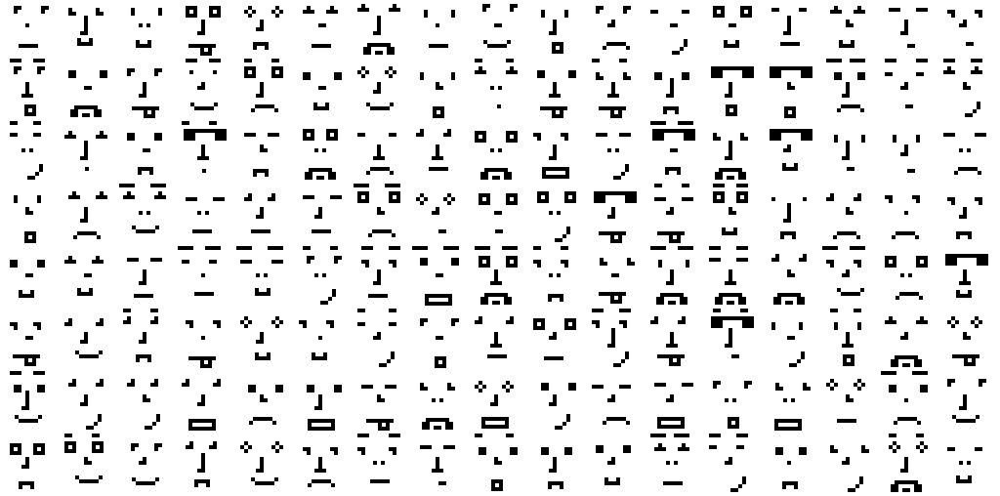

# pixel-face

A JavaScript library for generating simple pixel faces

<p align="center">
  
</p>

## Installation

```
    npm install --save pixel-face
```
or
```
    yarn add pixel-face
```

## Usage

Import and create new instance with options (optional)
```JavaScript
const FaceGenerator = require('pixel-face')

const face = new FaceGenerator()

// or

const face = new FaceGenerator({
    pixelSize: 10
})
```

Then, just generate new face. `generate` method returns Canvas instance from [node-canvas](https://github.com/Automattic/node-canvas)
```JavaScript
const canvas = face.generate()
```

And now we can store result as image
```JavaScript
const out = createWriteStream(path.join(__dirname, 'face.png'))
canvas.createPNGStream().pipe(out)
```